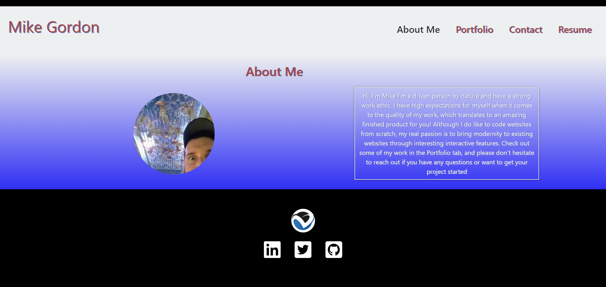
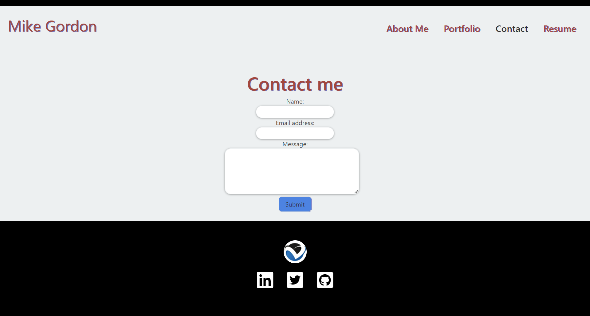
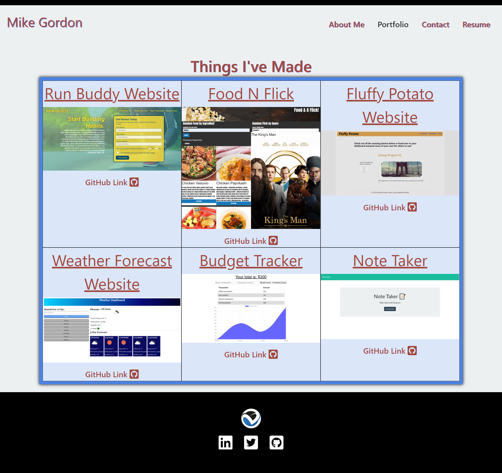
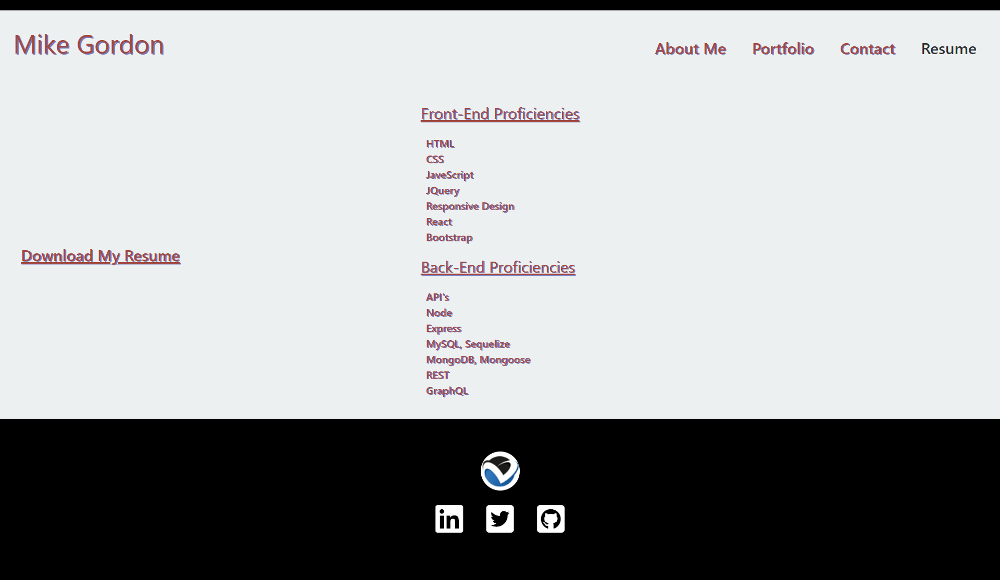

# Gordon React Profile

## Description

This is a single-page application portfolio

## Table of Contents

\*[Installation](#installation)

\*[Usage](#usage)

\*[License](#license)

\*[Contributing](#contributing)

\*[Questions](#questions)

## Installation

Once the repo has been cloned, please run npm install to ensure all dependencies are loaded. Then, do run the app in the development mode, type npm start in the command line

## Usage

All project links have been verified and will open the target in a new tab. Contact form will require a valid email and message to be entered and will display an error message when applicable. Upon form submit, the submitted form data will be displayed in the console and the form will clear. Screenshots of all "pages" are provided and deployed application can be seen [here](https://mike2481.github.io/gordon-react-profile/)

## License

This application is covered under the [MIT](./License/MIT.txt) license.

## Contributing

Pull requests are welcome. For major changes, please open an issue first to discuss what you would like to change.

## Questions

If you have any questions, please contact me by [email](mailto:vprmatrix55@gmail.com) or through [Github](https://github.com/Mike2481)
